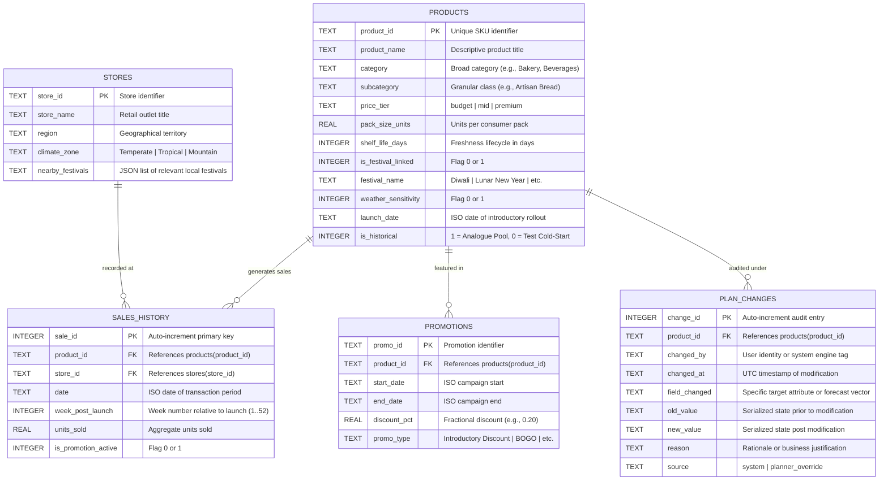

# Data Schema & Entity-Relationship Architecture

This document specifies the relational data model for the **New-Product Analogue Selector** decision-support platform (Phase 1).

---

## 1. Entity-Relationship Diagram (ERD)

---

## 2. Table Specifications & Data Dictionary

### `products`
The master registry of products across both historical reference items and upcoming cold-start candidates.
- `product_id` (TEXT, PK): Unique SKU code.
- `category` & `subcategory` (TEXT): Hierarchical categorization.
- `price_tier` (TEXT): Restricted to `budget`, `mid`, or `premium`.
- `pack_size_units` (REAL): Volume per pack (e.g., 1, 4, 6, 12).
- `shelf_life_days` (INTEGER): Expiry horizon. Directly informs retailer stockout aversion.
- `is_festival_linked` (INTEGER) & `festival_name` (TEXT): Flags if product launch coincides with cultural/regional events.
- `weather_sensitivity` (INTEGER): Binary flag (1 = demand swings with temperature/rain).
- `is_historical` (INTEGER): `1` for established products (analogue search pool), `0` for held-out cold-start test products.

### `stores`
Represents the retail distribution footprint across differing microclimates and festival geographies.
- `store_id` (TEXT, PK): Store branch identifier.
- `region` (TEXT): Operational regional cluster.
- `climate_zone` (TEXT): Regional climate characteristics.
- `nearby_festivals` (TEXT): Cultural events celebrated by the local store community.

### `sales_history`
Granular historical velocity logs. Used to construct empirical 8-week launch curves.
- `week_post_launch` (INTEGER): Relative launch milestone index ($W_1$ to $W_{52}$). In cold-start forecasting, initial weeks ($W_1 \dots W_8$) are the target horizon.
- `units_sold` (REAL): Weekly sales volume.
- `is_promotion_active` (INTEGER): Records if promotional discount influenced demand.

### `promotions`
Catalog of planned and historical promotional incentives.

### `plan_changes` (Immutable Audit Trail)
A non-repudiable audit ledger capturing every forecast proposal and manual override.
- **Append-Only Guarantee**: Enforced at the database engine level via SQLite triggers (`BEFORE UPDATE` and `BEFORE DELETE` aborting transactions).
- `source`: Distinguishes between automated generation (`system`) and human interventions (`planner_override`).
- `reason`: Mandatory text capture documenting why a change was accepted or adjusted.
